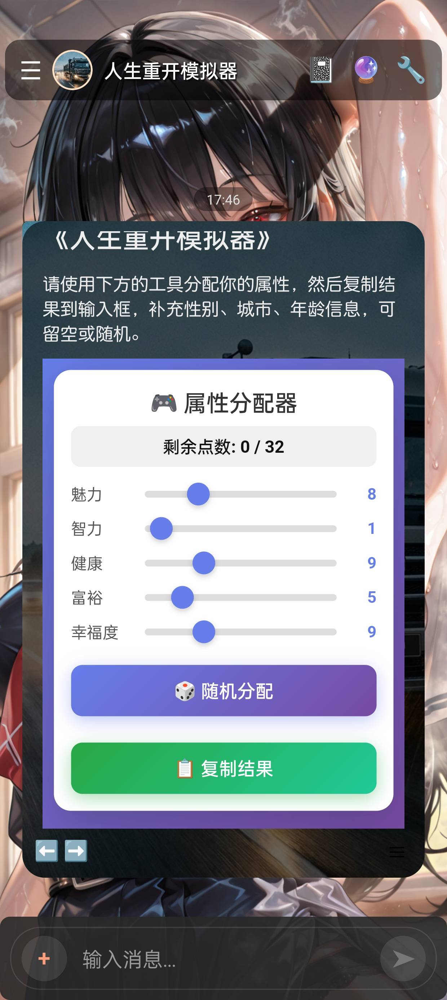
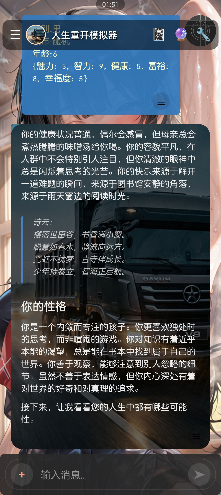
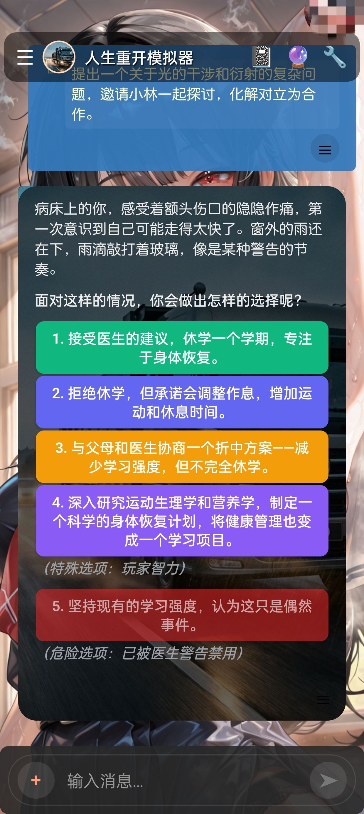
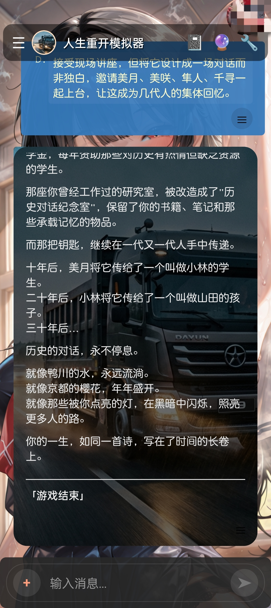

### 介绍
此分支是原项目https://github.com/EmbraceAGI/LifeReloaded 的Character Card（酒馆角色卡）移植，
作为安卓移动端项目https://github.com/fatsnk/forksilly.doc 的示例角色卡，仅用于展示角色卡的制作和使用。如果需要在sillytavern中使用，可能需要修改世界书中random宏。

#### 下载

  

### 使用方法

1. 在手机上下载并安装forksilly：https://github.com/fatsnk/forksilly.doc
2. 下载卡片：[原图](https://raw.githubusercontent.com/fatsnk/LifeReloaded/bee1d6d331327078e89be32ab8f467f3e35bf4c8/cards/%E4%BA%BA%E7%94%9F%E9%87%8D%E5%BC%80%E6%A8%A1%E6%8B%9F%E5%99%A8.png) 或[json](https://raw.githubusercontent.com/fatsnk/LifeReloaded/bee1d6d331327078e89be32ab8f467f3e35bf4c8/cards/%E4%BA%BA%E7%94%9F%E9%87%8D%E5%BC%80%E6%A8%A1%E6%8B%9F%E5%99%A8.json) （长按选择另存或下载到设备）
3. 在forksilly中导入角色卡。
4. 使用默认预设游玩，如果没有，请在预设管理中新建一个，并将Personal Description词条关闭，防止用户提示词影响模型。参考设置：[预设开关状态](https://github.com/fatsnk/LifeReloaded/blob/ccv2/cards/default_preset.jpg)

### 玩法

使用开局的属性分配器选择你的属性，决定好后，点击复制按钮，粘贴到输入框发送给AI。

### 常见问题

* 开场的属性分配器显示不完整：在主题设置中调整html内容高度，或者切换到卡片主题
* 属性分配器无法滚动：请滑动分配器之外的区域，或者使用双指滚动
* 不好玩？我也这么觉得，Claude4.5sonnet写得好差啊（ ~~*只是示例角色卡，凑活看看得了*~~
