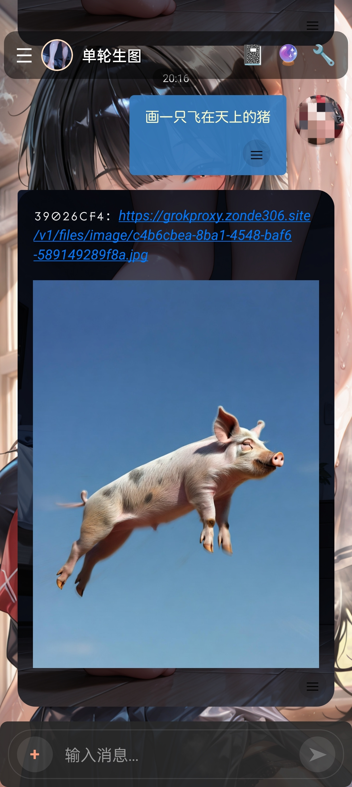
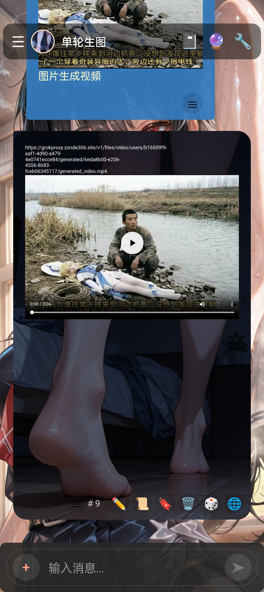

 

## 示例角色卡：单轮生图助手

用于方便查看和下载部分生图模型的API返回的markdown格式图片或video标签的视频。

此卡只会发送最后一条用户消息，用于部分不支持多轮聊天的API。如果你使用的API无此限制，可以到角色卡的正则中关掉第一个正则。

如图，返回markdown格式的图片内容时，可以点击蓝色链接跳转到浏览器下载。如果是应用内链接，则到应用的存储管理-gallery-llmimage中下载。

图二：对于`<video>`标签的视频，可以点击右下角的`≡`按钮展开更多按钮，点击蓝色地球图标切换到webview渲染，便可播放视频（仅适用卡片主题）

角色卡在这里，点击图片：

点击右上角的下载原始文件按钮下载原图，导入应用使用。
